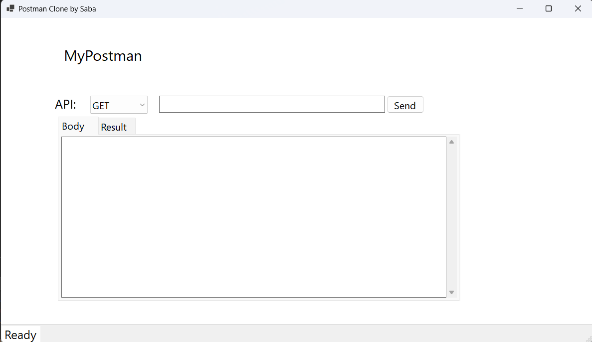
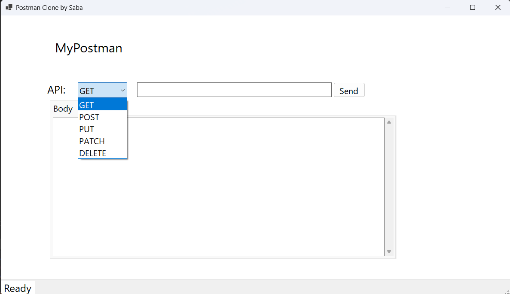
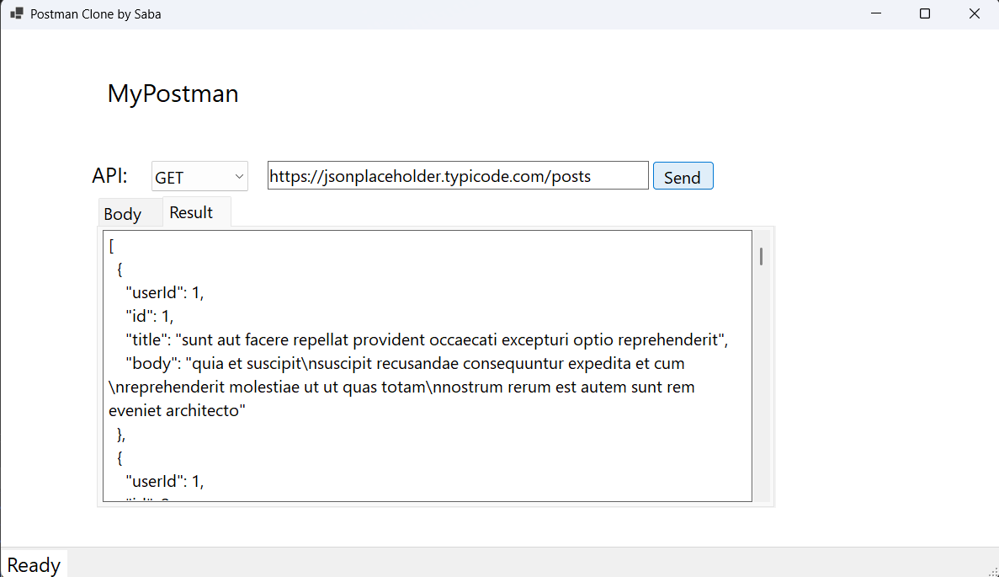

# MyPostmanApp

MyPostman app provides a user-friendly interface for making a HTTP requests to APIs and viewing the responses in a formatted JSON. Ideal for developers and testers, this tool simplifies API interaction and debugging, helping you to efficiently validate and troubleshoot your API calls.

## Technologies used
* C#
* .NET 8
* HttpClient
* WinForms

## How to use the application
1. Download the executable
2. Launch it. It should look like this:

3. Choose the HTTP Request

4. Fill in the URL

5. Done. Upvote <3

## Upcoming
Adding Authentication.
